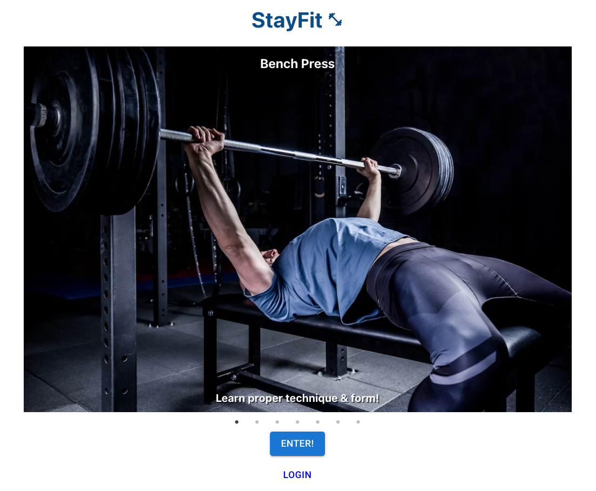
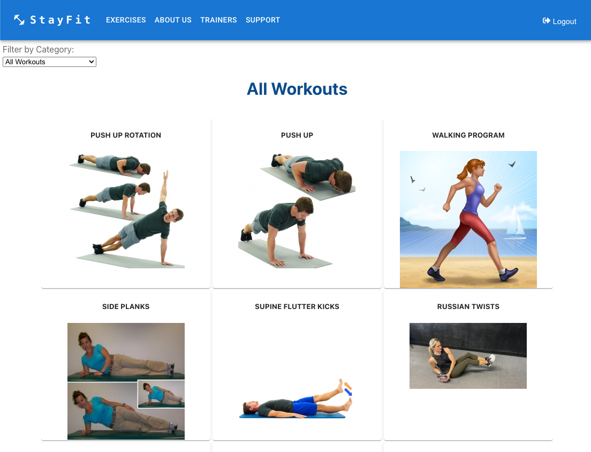

<!-- PROJECT LOGO -->

 

    

  <h3 align="center">StayFit Web App - The README.md File</h3>
  

 

# StayFit Web App

StayFit is a web-based physical fitness application that allows users to view instructions for targeted physical training exercises to help them achieve their personal fitness goals.

<!-- TABLE OF CONTENTS -->

  
Table of Contents

  <ol>
    <li>
      <a href="#about-the-project">About The Project</a>
      <ul>
        <li><a href="#project-overview">Project Overview</a></li>
      </ul>
      <ul>
        <li><a href="#technical-requirements">Technical Requirements</a>
      </ul>
      <ul>
        <li><a href="#team-response-to-requirements">Team Response to Requirements</a></li>
      </ul>
      <ul>
        <li><a href="#built-with">Built With</a></li>
      </ul>
    </li>
    <li><a href="#github-repo-and-usage">GitHub Repo and Usage</a></li>
    <li><a href="#known-issues">Known Issues</a></li>
    <li><a href="#license">License</a></li>
    <li><a href="#contact">Contact</a></li>
    <li><a href="#acknowledgments">Acknowledgments</a></li>
  </ol>

<!-- ABOUT THE PROJECT -->

## About The Project

### Project Overview

The StayFit web application is our capstone project for the <a href="https://kingslanduniversity.com/full-stack-developer-program/">Kingsland University 'Full Stack Developer' Program.</a>
 

### Technical Requirements

General Requirements to include:

- React.js for the client-side
- communication to a remote service
- Public Area (accessible without authentication)
- Private Area (available for registered users)
- Dynamic pages
- Authentication
- Client-Side Routing
- Data Validation

Demonstrate React.js specific programming concepts, including:

- Stateless and State-full Components
- Forms
- Events
- React Hooks
- Component Styling

Workflow:

- Use GitHub for version control
- Each team member shall make a minimum of two pull requests

(<a href="#top">back to top</a>)

### Team Response to Requirements

<b>Technical requirements:</b>

<ol>
    <li>General Requirements</li>
    <ul>
      <li>Backend: Node.js and Express</li>
      <li>Frontend: React.js</li>
      <li>Database: MongDB Atlas.</li>
      <li>established public and private areas</li>
      <li>JWT for authentication; BCrypt for password encryption</li>
      <li>implemented dynamic pages displaying exercises filtered by categories</li>
      <li>client-side routing using react-router-dom</li>
      <li>form data is validated & errors flagged with Toast notifications</li>
    </ul>        
    <li>Demonstration of React-Specific Programming Concepts</li>
    <ul>
      <li>both stateless and state-full function components used</li>
      <li>implemented forms using React.js & Chakra UI</li>
      <li>implemented onChange and onClick events</li>
      <li>useState, useEffect and custom hook used</li>
      <li>components styled using CSS</li>    
    </ul>     
</ol>

(<a href="#top">back to top</a>)

<b>Workflow requirements:</b>

<ol>
    <li>A GitHub repository was created.</li>
    <li>Team members were added as collaborators.</li>
    <li>Collaborators cloned the repo & each started a new branch.</li>
    <li>Collaborators on GitHub:</li>
    <ul>
      <li>used Pull Requests, making sure to tag a reviewer for approval.</li>
      <li>worked on branches of Main and merged our work through Pull Requests.</li>
      <li>had other teammates be Reviewers for their Pull Requests.</li>
    </ul>  
</ol>

(<a href="#top">back to top</a>)

<!-- EXERCISES -->

 

    
  

 

### Built With the MERN Stack

- [MongoDB](https://mongodb.com)
- [Express](https://expressjs.com)
- [React.js](https://react.dev)
- [Node.js](https://nodejs.org)

(<a href="#top">back to top</a>)

<!-- USAGE  -->

## GitHub Repo and Usage

Visitors are encouraged to go to our GitHub repository to examine the code behind the functionality of the web app.

GitHub Link: [https://https://github.com/tarenpang/blockchain](https://https://github.com/tarenpang/blockchain)

<ol>
    <li><b>npm install</b> - in each of the following directories:</li>
    <ol>
      <li>blockchain</li>
      <li>backend</li>
      <li>frontend</li>
</ol>

<li>Start the app in the blockchain directory: <b>npm run start</b></li>

(<a href="#top">back to top</a>)

<!-- ROADMAP -->

## Stretch Goals

The following are stretch goals that are currently on our road map:

<ol>
  <li><b> Private Web Application Areas to Be Developed.</b> Registration and Login for Users and Trainers has been implemented. Stretch goals include: 1) Enabling registered users to pick a personal trainer and describe their fitness goals, 2) Enabling logged in users to select and tag exercises as 'favorites', and 3) enabling logged in trainers to design a personalized training schedule for individual users based on their fitness goals</li> 
  <li><b>User and Trainer Profile Images.</b>We plan to enable users and trainers to upload images of themselves. The uploaded profile image will be displayed both in their profile page, and also in the profile image circle when they are logged in.</li> 
</ol>

(<a href="#top">back to top</a>)

<!-- LICENSE -->

## License

Distributed under the GNU GPLv3 License.

(<a href="#top">back to top</a>)

<!-- CONTACT -->

## Contact

https://www.linkedin.com/in/paolo-camacho-2b18ba247/

https://www.linkedin.com/in/rahul-bala-3b153b102/

https://www.linkedin.com/in/joshua-baum-627a0a217/

https://www.linkedin.com/in/taren-pang-5430ab14/

(<a href="#top">back to top</a>)

<!-- ACKNOWLEDGMENTS -->

## Acknowledgments

This project would not have been possible without the support and encouragement of the following individuals:

<ol>
  <li>Our instructors: <b>Ron Cagle</b> at <a href="https://kingslanduniversity.com/">Kingsland University</a> for expertly guiding us through the course.</li> 
  <li>Administrators: <b>Rhochelle Kadusale</b> for keeping us on track on the administrative side of things.</li> 
</ol>

(<a href="#top">back to top</a>)

